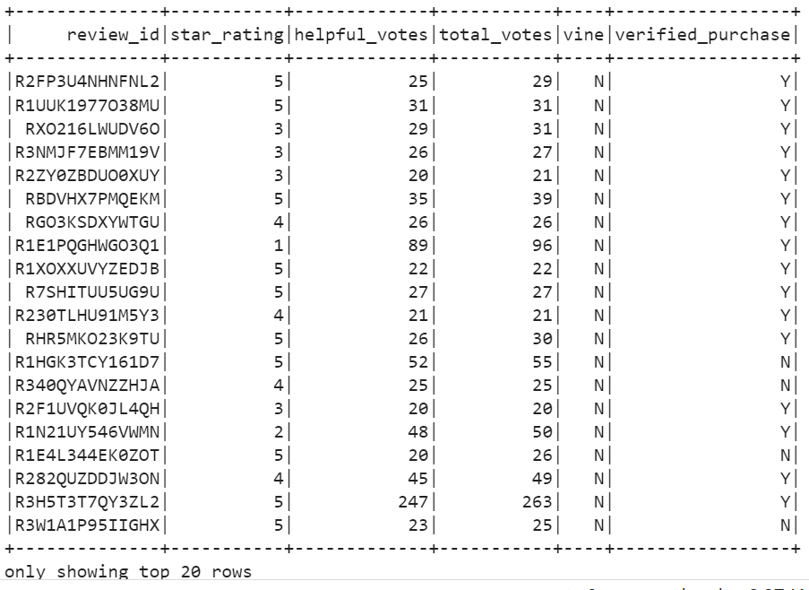
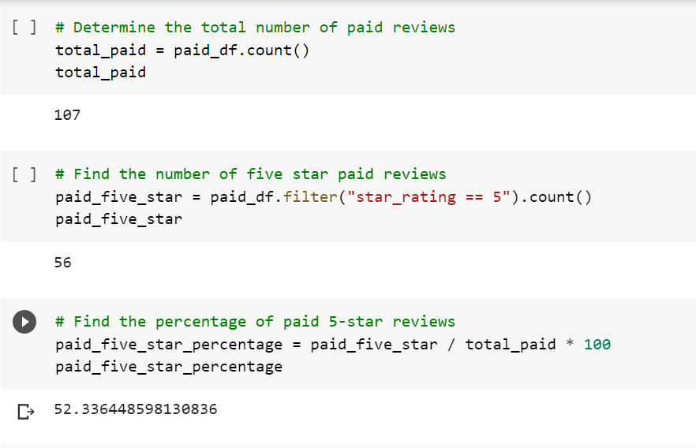
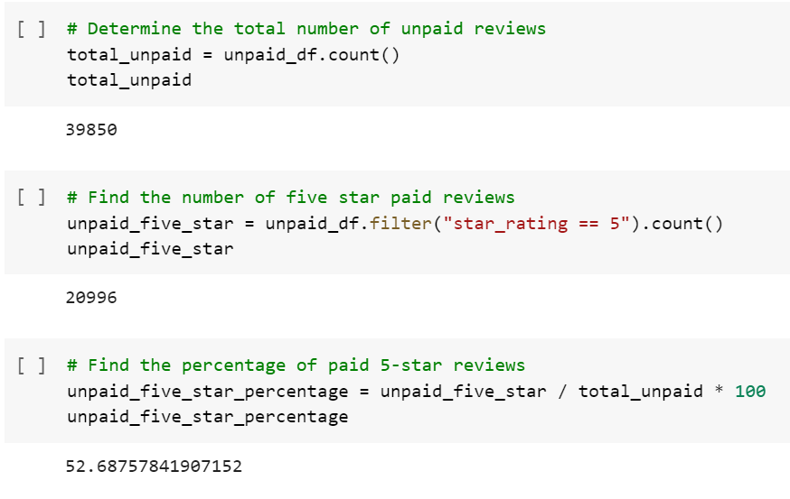

# Amazon Vine Analysis

## Overview
Amazon review data from a specific category of products (Outdoors) was analyzed to determine if any bias exists between members and non-members of the paid Amazon Vine program.

## Results
The data was filtered to only include reviews in which the combined votes (both helpful and not) totaled at least 20, and at least 50% of those votes were helpful. Below are the first 20 rows of the filtered DataFrame.

**Analysis of filtered reviews from Vine members**

**Analysis of filtered reviews non-Vine customers**

- There were 107 Vine reviews and 39,850 non-Vine reviews.

- 56 Vine reviews and 20,996 non-Vine reviews were rated 5 stars.

- 52.34% of the Vine reviews were 5 stars.
- 52.69% of the non-Vine reviews were 5 stars.
- There was a 0.35% difference between the Vine and non-Vine 5-star review percentages.

## Summary

Since the percentage of 5-star reviews were so close (0.35% difference) among Vine and non-Vine reviews, no positivity bias exists for this data sampling.

Since the sample size of Vine members in the filtered data is low (107 total reviews), further analysis could be performed on on the unfiltered data to see if the percentages vary. Additionally, reviews from other product categories could easily be inserted into this code to see if discrepencies exist elsewhere.